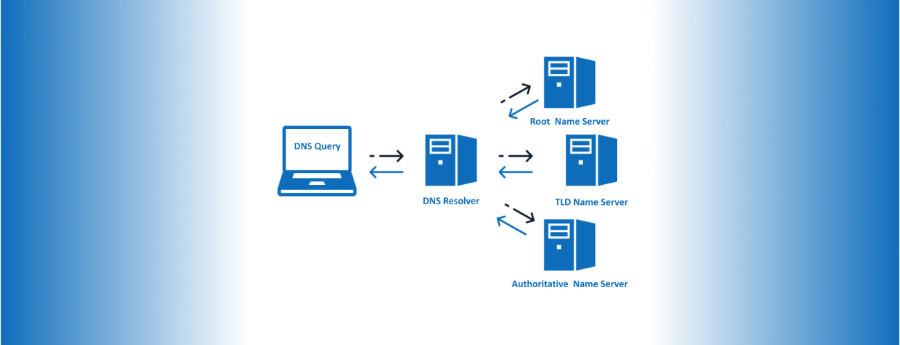

# Week1

## Introduction

1. Who am I
2. What do we do
3. What can you expect

| Weeks | Contents | Q&A |
| :---: | :------: | :-: |
| Week1 | Command Line Basics | |
| Week2 | Command Line Basics Cont. | TBR |
| Week3 | Other Tools and Shell Scripting | |
| Week4 | Tools for C (and other languages) | TBR |
| Week5 | Algorithms: Sort and Search (and Paper) |
| Week6 | Paper Continued | TBR |
| Week7 | Network Basics | | |
| Week8 | Functional Programming: Haskell and Others | TBR |
| Week9 | Delve deeper into FP (A Real Project) | |
| Week10 | Continue + Q&A + Prepare for holiday :) | TBR |
| Week11 | Frontend Basics | |
| Week12 | Backend Basics | TBR |
| Week13 | Basic C++ and C++ vs. C | |
| Week14 | Ideas behind Modern C++ and STL | TBR |
| Week15 | Java vs. C++ | |
| Week16 | Can we be safer? | TBR |
| Week17 | Algorithms: Dynamic Programming | |
| Week18 | Algorithms: Greedy | TBR |
| Week19 | Design Patterns | |
| Week20 | `Special` | TBR |

## Uni-Related

1. What will you learn in 1st/2nd term

| Course | Contents | Coursework/Exam |
| :---: | :------: | :---------: |
| Engineering Challenges (ENGF0001) | | A video + A bioreactor! |
| Design and Professional Skills 1 (ENGF0002) | Learn some Python | Tetris + Design a Protocol + Do a project + Presentation + Write a Report |
| Principles of Programming (COMP0002) | Learn some C + Haskell | Program a bot + Design a Set + Exam |
| Discrete Mathematics for Computer Scientists (COMP0147) | Set + Function + Group + Discrete Algorithms + Matrix | Two online quizzes + Exam |
| Theory of Computation (COMP0003) | Logic + Automata | Exam |
| Object-Oriented Programming (COMP0004) | Java | Web Design + Exam |
| Algorithms (COMP0005) | Search + Sort + Graph + String | A trading platform + Exam |
| Mathematics and Statistics (COMP0011) | Complex Number + Calculus + Vector Space + Matrix... | Exam |

2. How could we support you
   - Week5: Algorithms: Sort and Search (and Paper)
   - Week7: Network Basics
   - Week9: Delve deeper into FP (A Real Project)
   - Week11: Frontend Basics
   - Week17-18: Algorithms

## Logistics

1. How to access the materials?
2. Absence Policy
   - There are no absent policy!
3. How should you use discord?
4. Something about "the messages" in Discord
   - Exchangeable Image File Format

## Setting up your environment

1. Links here: [Setting up your environment](https://greenfrogs.github.io/ucl_cs_setup_your_environment/#/)
     - An additional link for C: [Install MinGW-x64](https://code.visualstudio.com/docs/languages/cpp#_example-install-mingwx64)
2. But more... (why not try vscode?)

### vscode

1. What is vscode?
2. How could it empower your development? (a short demo on C/C++, Python (Jupyter), Haskell, Java)

### Python

1. Python

### C/C++

1. C/C++ from Microsoft
2. `clangd`

### Haskell

1. Haskelly (created by UCL students)
2. Haskell

### Java

1. Install Language support for Java for Visual Studio Code
2. Maven for Java
3. Test Runner for Java

### Other Extensions

1. Better Comments
2. Error Lens
3. Themes: One Dark Pro / vscode-icons
4. Wakatime
5. If you want to learn more tools: Trunk and Vim are waiting for you

## Command Line

> Parts of this section are excerpted from [Welcome to Linux command line for you and me!](https://lym.readthedocs.io/en/latest/startingcommands.html)

The following contents are only for Unix-like OS. Some of them are exclusively for Linux.

### Shell

1. What is shell and terminal emulator?
2. `date`, `cal`, `tree`, `wc`, `echo`
3. Redirection and Pipes
4. `man` page
   - Read the [man page for man-page](https://man7.org/linux/man-pages/man7/man-pages.7.html)

#### Shell Tools

1. If you are using zsh, you can install `oh-my-zsh` via brew
2. Choose a theme (the default is good)
3. Install some extensions
   - `zsh-syntax-highlighting`
   - `zsh-autosuggestions`
   - `git`
   - `colored-man-page`
   - `z`

### File-related command

1. `cd`, `ls`, `rm`, `mkdir`, `touch`, `tee`
2. Their advanced options and meanings
   - File Permissions
   - `chmod`

### Useful commands

1. Soft Links and Hard Links
   - What are them?
   - How to create them?
2. `tar` files
   - What are `tar` files?
   - Extraction
   - Compression
3. Using `sudo` command
4. Environment variables
   - `PATH`
   - `printenv`
   - shell variables
   - Create/Delete new environment variables ("permanent"/temporary)
5. Sort files by size
   - use `-S` options from `ls`
   - use `sort`
6. Some `!` trick
   - Repeat previous `n` lines
   - Repeat the closest line starts with `x`
   - Repeat the closest line includes `x`

### Networking Command (Optional)

> Read this section iff you have some basic Network knowledge.
>
> You can read the first two sections of [Introduction to the Domain Name System (DNS)](https://opensource.com/article/17/4/introduction-domain-name-system-dns) before exploring the following topics.

1. `ping` and `traceroute`
   - What is TTL?
   - How does `traceroute` work?
2. DNS and its lookup rules
   - What happens when we visit a website?
   - Recursive Lookup 
   - `dig` with example
3. hosts file
   - What is `hosts`?
   - Path
      - Windows: `C:\Windows\System32\drivers\etc`
      - Mac: `/etc/hosts`

## References

1. [Welcome to Linux command line for you and me!](https://lym.readthedocs.io/en/latest/index.html)
2. [AUTHORITATIVE VS RECURSIVE DNS: WHAT YOU NEED TO KNOW](https://www.dnsfilter.com/blog/authoritative-vs-recursive-dns)

## License

MIT License

Copyright (c) 2022 Yuxiang Qiu

Permission is hereby granted, free of charge, to any person obtaining a copy
of this software and associated documentation files (the "Software"), to deal
in the Software without restriction, including without limitation the rights
to use, copy, modify, merge, publish, distribute, sublicense, and/or sell
copies of the Software, and to permit persons to whom the Software is
furnished to do so, subject to the following conditions:

The above copyright notice and this permission notice shall be included in all
copies or substantial portions of the Software.

THE SOFTWARE IS PROVIDED "AS IS", WITHOUT WARRANTY OF ANY KIND, EXPRESS OR
IMPLIED, INCLUDING BUT NOT LIMITED TO THE WARRANTIES OF MERCHANTABILITY,
FITNESS FOR A PARTICULAR PURPOSE AND NONINFRINGEMENT. IN NO EVENT SHALL THE
AUTHORS OR COPYRIGHT HOLDERS BE LIABLE FOR ANY CLAIM, DAMAGES OR OTHER
LIABILITY, WHETHER IN AN ACTION OF CONTRACT, TORT OR OTHERWISE, ARISING FROM,
OUT OF OR IN CONNECTION WITH THE SOFTWARE OR THE USE OR OTHER DEALINGS IN THE
SOFTWARE.