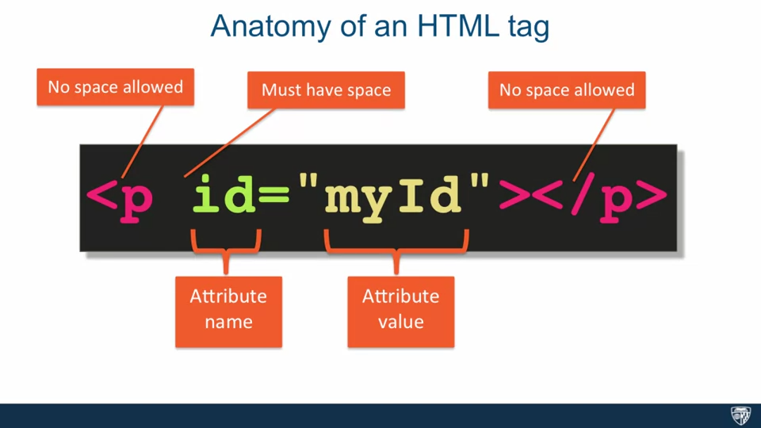
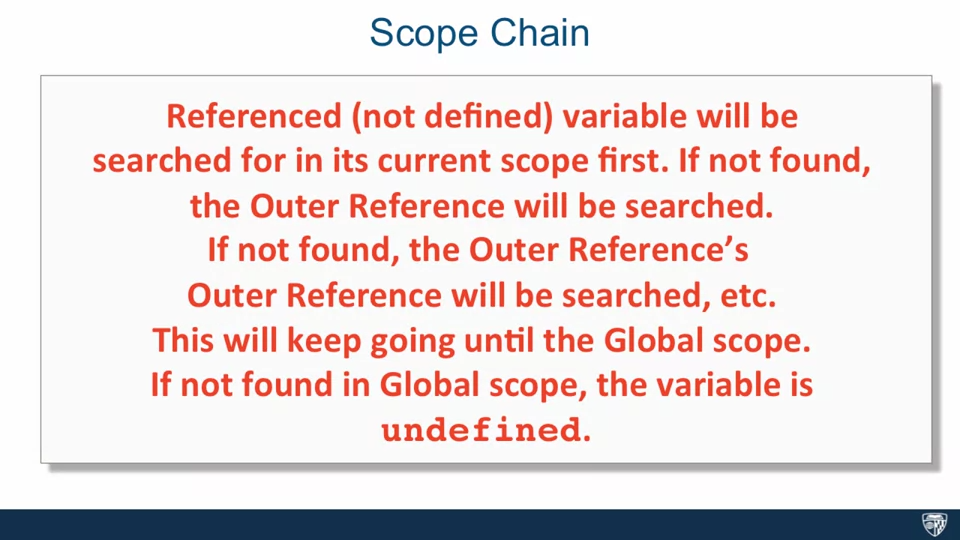

# Week 11

## HTML

1. What is HTML
   1. > Hyper Text Markup Language. Hypertext is text which contains links to other texts. One document points to another document which points to a bunch of other documents...Markup means to mark something up, to annotate. It's really all about content, and you want to annotate the content to tell the browser what this content is. Language basically implies that it has its own syntax meaning there's a right and a wrong way to code it.

2. HTML Tags
   1. Opening and Closing tags
   2. `
`
   3. ` `, `
`
   4. Attributes
      1. 

3. Basic HTML Document Structure
   1. W3C web validator
   2. `<!doctype html>`
      1. > All it does is tell the browser that it should get ready to render HTML. This declaration is really largely historical. When HTML standards were first becoming popular, the web was full of pages that were not compliant with the standards. To help browsers render those pages correctly, browsers used the doctype declaration to distinguish between noncompliant and compliant pages. Noncompliant pages were rendered in what's called the quirks mode, and the compliant pages were rendered in what's called the standards mode. Now, that's all historical. But what you need to know today is that if you leave off the HTML page declaration, that will signal to the browser that it should treat your pages as one not following HTML standard.
   3. `<html>` tag
   4. `<head>` tag
      1. > It can contain authors description of the page, page title, and whatever other external resources are needed to render the page properly, among other things. The point is it contains some metadata about the main content.
   5. `<body>` tag
   6. "Renders or interprets the HTML code sequentially from top to bottom"

4. HTML Content Models
   1. > The term content model refers to the full behavior the browser applies to the elements belonging to that content model, and to the nesting rules of those elements. In other words, which elements are allowed to be nested inside which other elements. All elements fall into basically two categories under the traditional content model structure: block level elements or inline elements. Block level elements render to begin on the new line by default. So what that means is every time you specify a block-level element in HTML, the browser will automatically place that element on a new line in the flow of the document. **Block-level elements are allowed to contain inline or other block-level elements within them.** This is in contrast to inline elements, which render on the same line by default. Which means if you put a whole bunch of inline elements next to each other, they will all be going on on the same line, as if there is no new line character present. Inline elements also have a restriction that they can only contain other in line elements.
   2. `
` tag
      1. > The div element stands for division. It is the most generic block-level element.
   3. `` tag
      1. > The span element stands for span. It is the most generic inline element.
   4. Demo
      1. > Even though span is an inline element, since DIV 2 requires that it be on it's own line. It pushes the next inline element to it's own line as well. And this is exactly what happens with DIV 3.
      2. > The new line characters that follow the div tags make absolutely no difference to the html page and how it renders.

5. Heading Elements
   1. `<h1>`, `<h2>`, `<h3>`, `<h4>`, `<h5>`, `<h6>`
   2. More tags
      1. `<article>`: [doc](https://developer.mozilla.org/en-US/docs/Web/HTML/Element/article)
      2. `<section>`
      3. `<aside>`
      4. `<footer>`

6. Lists
   1. Unordered List `<ul>`
   2. Ordered List `<ol>`
   3. List Item `<li>`

7. HTML Character Entity References
   1. An HTML entity is a piece of text ("string") that begins with an ampersand (&) and ends with a semicolon (;)
   2. Escape
      1. `< == &lt;`, `> == &gt;`, `& == &amp;`
   3. [A list of Character Entity](https://oinam.github.io/entities/)

8. Creating Links
   1. `<a>`
   2. `href` attribute: hypertext reference
   3. Internal Link
   4. External Link
   5. Anchor Link

9.  Displaying Images
   1. ``: inline element
   2. `width` and `height` attribute
   3. `alt` attribute
   4. Demo: How to use Developer Tools

## CSS

1. What is CSS
   1. Cascading Style Sheet

2. CSS basics
   1. Selector
   2. Declaration
      1. Property
      2. Value

3. Element, Class, and ID selector
   1. Element Selector
   2. Class Selector
   3. ID Selector
   4. `*` (universal) selector
   5. Group Selectors

4. Combining selector
   1. Element with class selector `p.className` (every `
` with class name `className`)
   2. Child Selector `article > p` (every `
` directly inside `<article>`)
   3. Descendent Selector `article p` (every `
` inside `<article>`)

5. Pseudo-class selector
   1. `selector:pseudo-class {}`
   2. `visited`
   3. `hover`
   4. `nth_child`

6. Style Placement
   1. On element
   2. On `<style>`
   3. On `css` file (In real-life prefer this)

7. Conflict Resolution
   1. 
   2. Origin Precedence: the last declaration wins
   3. Merge: declarations are merged when no conflicts
   4. Inherit: declarations inherit from parent (conflicting declarations in children win)

      

   5. Specificity: Most specific selector combination wins

      

8. The Box Model
   1. 
   2. `box-sizing: border-box` (default is `content-box`) and width
   3. Cumulative Margin:

      

      

   4. Overflow

9.  Position elements (floating)
    1.  `float` takes element out or the regular document flow
    2.  Margin at the top of the box (no cumulative margin now)
    3.  Why clear both?

10. Element positioning
    1.  Static Positioning: normal document flow
        1.  default for tags except `<html>`
    2.  Relative Positioning: element is positioned relative to its position in normal document flow
        1.  not taken out of the normal document flow
        2.  `top`, `right`, `bottom`, `left`
        3.  `<html>` has relative
    3.  Absolute Positioning
        1. element is taken out from the normal document flow
        2. "All offsets (top, bottom, left, right) are relative to the position of the nearest ancestor which has positioning set on it, other than static."
    4. What happens if `float` is combined with relative/absolute?

11. Media Query and Responsive Design
    1.  "Media queries allow you to group styles together and target them to devices based on some criteria."
    2. General Syntax `@media (media-feature) {/* styles inside */}`
    3. Media features
       1. `min-width: 768px`
       2. `max-width: 768px`
       3. `print`
    4. Logical Operator
       1. `and`: `(min-width: 768px) and (max-width: 991px)` (query devices within a range)
       2. `,` (or): `(max-width: 767px) , (min-width: 992px)` (query devices at least 992px or at most 767px)
    5. Not to overlap boundary: otherwise, all the styles will be applied
    6. Responsive Design

       

12. More to Explore
    1.  Styling Text
    2.  Styling Background
    3.  Element Positioning: `fixed` and `sticky`
    4.  Bootstrap

## Javascript

1. What is Javascript

2. Where to put the script
   1. `<script>`
   2. [Differences between href and src](https://stackoverflow.com/questions/3395359/difference-between-src-and-href)

3. Define variables, Functions and Scope
   1. `var`
   2. `function`
   3. Scope
      1. Global: variables/functions defined here are available everywhere
      2. Function: only available within this function
      3. Lexical Scope vs. Dynamic Scope (JS uses Lexical Scope)
   4. Scope Chain
      1. How JS looks for variables
      2. 
      3. 
   5. Execution Contexts: [JavaScript Execution Context – How JS Works Behind the Scenes](https://www.freecodecamp.org/news/how-javascript-works-behind-the-scene-javascript-execution-context)
   6. Differences between `var` and `let`
      1. Read the previous link about execution context first
      2. [Difference between var and let in JavaScript](https://www.geeksforgeeks.org/difference-between-var-and-let-in-javascript/)
      3. [let](https://developer.mozilla.org/en-US/docs/Web/JavaScript/Reference/Statements/let)

4. Types
   1. [JavaScript Data Types](https://www.w3schools.com/js/js_datatypes.asp)

5. Objects
   1. Basics
   2. Constructor
   3. Prototype
   4. `this`

6. Array, Closure and Namespaces
   1. Array
   2. Closures
   3. IIFE

## WebDev Overview

1. Summary
   1. HTML = "skeleton"; CSS = "skin"; JS = interaction
2. A brief overview of web dev (three stages)
   1. Backend render the page (php...)
   2. Frontend requests backend API and renders the page at the frontend (react, vue, angular... + some backend services)
   3. Frontend requests + some server-side rendering (next.js...)

## References

This week's material is from [HTML, CSS, and Javascript for Web Developers](https://www.coursera.org/learn/html-css-javascript-for-web-developers). It contains only a small portion of the content discussed in the course. If you are interested in front-end development, you can take the entire course for free at coursera.

## Additional Resources

1. [CSS Selector Performance](https://blogs.windows.com/msedgedev/2023/01/17/the-truth-about-css-selector-performance/)
2. [A website without any HTML (except for some meta tags)](https://no-ht.ml/)
3. [The Surprising Things That CSS Can Animate](https://codersblock.com/blog/the-surprising-things-that-css-can-animate/)