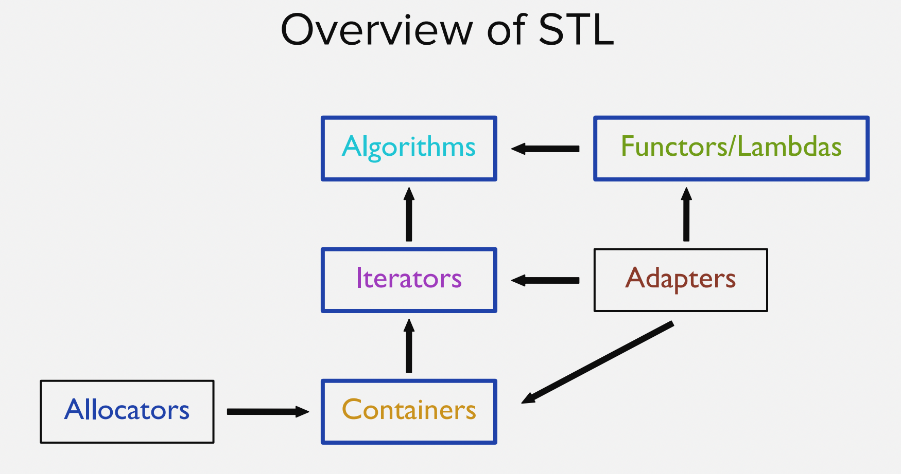
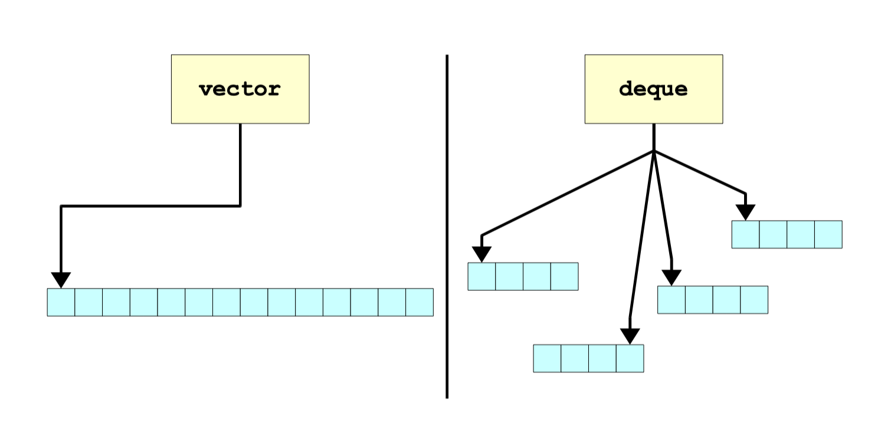

# Week 14

> all the code in this week is compiled with `-std=c++11`.

## Structure of STL

## Containers

### Sequence Containers

1. `std::vector`
   1. Sort Demo: `size`, `operator[]`
   2. constructor
   3. `push_back`
   4. clear
   5. `insert` and `erase`
2. `std::deque`
   1. Double-ended Queue
        
   2. `push_back`, `push_front`, `pop_back`, `pop_front`
   3. Deque vs. Vector
3. `std::list`
   1. A doubly linked list
   2. push..., pop...
   3. size, empty...
   4. insert, erase
4. `std::forward_list`
   1. A singly linked list
   2. `std::forward_list` vs. `std::list`
   3. insert (at the beginning), erase

### Associative Container

1. `std::set`
   1. An unordered list of elements
   2. insert, erase
   3. size, empty...
   4. Custom Type: `operator<`
2. `std::map`
   1. Key-Value pair
   2. Access `operator[]`, `find`
   3. `std::pair` and `std::tuple`
   4. insert, erase
   5. size, empty
3. `std::unordered_set`
   1. A hashmap-based container
   2. Hashing
   3. insert, erase
   4. size, empty...
   5. Custom Type: `hash` and equality
4. `std::unordered_map`
   1. Key-Value pair
   2. insert, erase
   3. size, empty...
   4. Custom Type: `hash` and equality
5. `multiset`, `multimap`

> Question: why they have similar APIs?

## Adaptors

1. Why Adaptor?
2. `std::stack`
   1. Based on vector by default
   2. `top`
   3. `push`, `pop`
3. `std::queue`
   1. Based on deque by default
   2. `front`, `back`
   3. `push`, `pop`
4. `std::priority_queue`
   1. Based on vector by default
   2. Application: heap sort

## Iterators

1. Range-based for loop
   1. Demo C++Insights: What's the mechanism?
2. Behaviors
   1. **Dereferencing** the iterator to read a value: `operator*`
   2. **Advancing** the iterator from one position to the next: `operator++`
   3. **Comparing** two iterators for equality: `operator==`
4. Types of Iterator
   1. InputIterator: single-pass, read-only
   2. OutputIterator: single-pass, write-only
   3. ForwardIterator: multi-pass, read/write, uni-direction
   4. BidirectionalIterator: multi-pass, read/write, multi-direction
   5. RandomIterator: multi-pass, read/write, random pos
5. Const Iterator
6. Iterator Adaptor
   1. `std::back_inserter`
   2. `std::ostream_iterator`
   3. Turns out to be useful when we know Algorithm

## Functor

> count_if example: count the number of items that make `Pred == true`

1. Function Pointer
2. Function Object
   1. `operator()`
   2. Key Characteristics: has states
   3. Higher Order Programming: functions as parameters, currying (`std::bind`, lambda)
3. Lambda
   1. Simplify Function Object
   2. Syntax: `{}`
   3. Capture
   4. Params List
   5. Function Body
   6. `mutable`

## Algorithm

1. `std::accumulate`
2. `std::count`
3. `_if`: `std::count_if`, `std::copy_if`
4. `std::sort`
5. `std::shuffle`
   1. How to design an efficient random shuffling algorithm?
   2. Key Property: Random
6. `std::binary_search`, `std::lower_bound`, `std::upper_bound`
7. `std::remove` and `container.erase` paradigm, and `std::erase` (since C++20)
8. `std::next`, `std::distance`

If you want to learn more about algorithm, refer to [CppCon 2018: Jonathan Boccara “105 STL Algorithms in Less Than an Hour”](https://www.youtube.com/watch?v=2olsGf6JIkU)

## Reference

This work was largely inspired by the CS106L course readings. If you want to learn more about C++, you can start here.