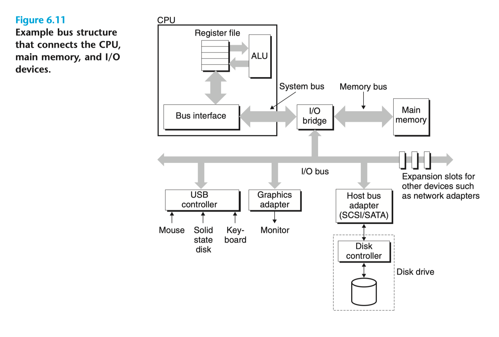
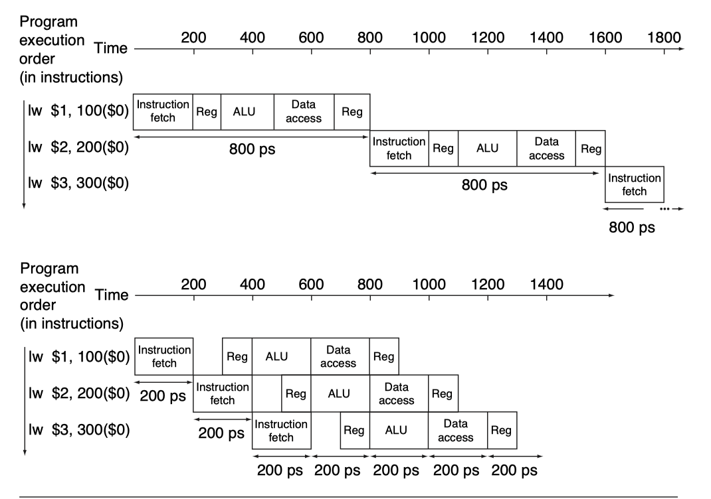

# Week 15

> Towards Language Layer...

## Abstract Machine

> In computer science, an abstract machine is a theoretical model that allows for a detailed and precise analysis of how a computer system functions. Abstract machines vary from literal machines in that they are expected to perform correctly and independently of hardware. Abstract machines are "machines" because they allow step-by-step execution of programmes; they are "abstract" because they ignore many aspects of actual (hardware) machines. A typical abstract machine consists of a definition in terms of **input, output, and the set of allowable operations** used to turn the former into the latter. They can be used for purely theoretical reasons as well as models for real-world computer systems. In the theory of computation, abstract machines are often used in thought experiments regarding computability or to analyse the complexity of algorithms. \[1\]

- Definition
  - Machine
  - Abstract
- Usage \[2\]
  - Provide an intermediate language stage for compilation
  - Bridge the gap between the high level of a programming language and the low level of a real machine
  - Simplifies the presentation and teaching of the principles of programming language implementations
  - The introduction of layers of abstraction increases maintainability and portability and it allows for design-by-contract
  - Abstract machines have been successful for the design of implementations of languages that do not fit the “Von-Neumann computer” well
  - Facilitate to prove the correctness of code generation, program analyses and transformations

## C++ Abstract Machine Definition

I will refer to [Back to Basics: The Abstract Machine - Bob Steagall - CppCon 2020](https://github.com/CppCon/CppCon2020/blob/main/Presentations/back_to_basics_the_abstract_machine/back_to_basics_the_abstract_machine__bob_steagall__cppcon_2020.pdf) in this section. \[3\]

### Before We Begin

1. A quick look at the modern computer \[4\] \[5\]

    

    

2. ILP (Instruction Level Parallelism)
   1. Procedure: can roughly divide into 4 steps
   <!-- Picture -->
   2. Optimization: ILP

### Definition

1. Demo:
   1. [Observable Behavior - 1](https://gcc.godbolt.org/z/j4ofYfsab)
   2. [Observable Behavior - 2](https://gcc.godbolt.org/z/hYM96r9r6)

### Program

### Memory

### Object

### Summary

> When we write C++ code, we are writing to the C++ abstract machine

## Execution Model

I will refer to [Core C++ 2019 :: Bryce Adelstein :: The C++ Execution Model](https://corecppil.github.io/CoreCpp2019/Presentations/Bryce_C++_Execution_Model.pdf) in this section. \[6\]

> Stage 1: Terminology

### Storage

### Thread of Execution

> Stage 2: Understand the Building Block

### Expression

### Expression Evaluation

1. Value Computation
2. Side Effect

### Ordering (Intra-Thread)

1. Sequence Before
   1. Definition: Asymmetric, Transitive
   2. Applications (rules about expressions ordering)
2. Intermediate Sequence
3. Un-sequenced
   1. Example

### Statements

> Stage 3: Start to Evaluate Constructs

### Evaluation

1. Function Evaluation
   1. Rules
   2. Examples
2. Operator Evaluation
   1. Rules

> Stage 4: Across the threads

### Ordering (Inter-Thread)

1. Synchronize with
   1. Asymmetric, Transitive
2. Happens Before
   1. Combining Sequence Before and Synchronize With
   2. Application: basic ordering when we describe the behaviors of multi-threaded program

### Execution Steps

Observable Behaviors + Termination of the thread

### Forward Progress

1. Why we need this?
2. Block
3. "Good things eventually happen"
   1. [Undefined Behavior Demo](https://gcc.godbolt.org/z/a8jWe1zE9): why is this reasonable under our framework?
4. Types of Forward Progress (From strong to weak)
   1. Concurrent Forward Progress
   2. Parallel Forward Progress
   3. Weakly parallel forward progress

## References

\[1\]: [Wikipedia: Abstract machine](https://en.wikipedia.org/wiki/Abstract_machine)

\[2\]: "Diehl, Stephan, Pieter Hartel, and Peter Sestoft. \"Abstract machines for programming language implementation.\" Future Generation Computer Systems 16.7 (2000): 739-751."

\[3\]: [Back to Basics: The Abstract Machine - Bob Steagall - CppCon 2020](https://github.com/CppCon/CppCon2020/blob/main/Presentations/back_to_basics_the_abstract_machine/back_to_basics_the_abstract_machine__bob_steagall__cppcon_2020.pdf)

\[4\]: Randal E. Bryant and David R. O'Hallaron. 2015. Computer Systems: A Programmer's Perspective (3rd. ed.). Pearson.

\[5\]: David A. Patterson and John L. Hennessy. 2013. Computer Organization and Design, Fifth Edition: The Hardware/Software Interface (5th. ed.). Morgan Kaufmann Publishers Inc., San Francisco, CA, USA.

\[6\]: [Core C++ 2019 :: Bryce Adelstein :: The C++ Execution Model](https://corecppil.github.io/CoreCpp2019/Presentations/Bryce_C++_Execution_Model.pdf)

## Additional Resources

Some discussions about the C/C++ Abstract Machine and Standard:

- [C was not created as an abstract machine](https://news.ycombinator.com/item?id=34623007)
- [Undefined behavior, and the Sledgehammer Principle](https://thephd.dev/c-undefined-behavior-and-the-sledgehammer-guideline)